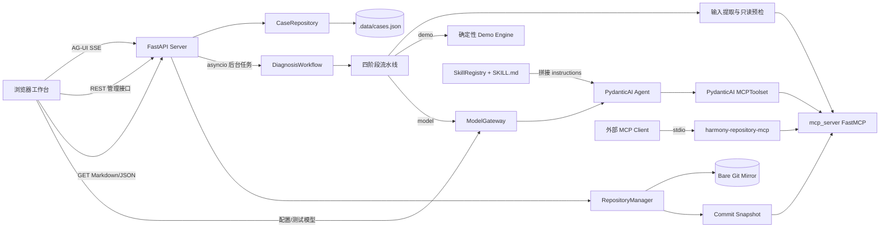
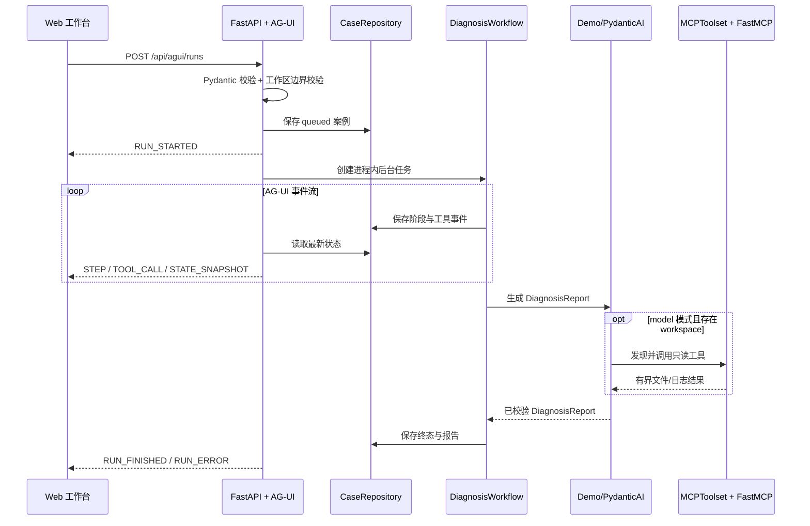

# HarmonyOS 问题诊断 Agent MVP 技术设计

## 1. 文档目的

本文描述当前四层 Agent 应用的真实实现、接口与边界。系统以 PydanticAI 为 Agent 底座，以
FastAPI + AG-UI 提供事件流，以标准 `SKILL.md` 组织诊断规则，并以独立 FastMCP 服务提供只读
项目检查工具。

当前目标是完成“描述问题 -> 定位范围 -> 排查证据 -> 输出诊断”的静态诊断闭环，不负责代码修复、构建、运行、设备调试或 DevEco CLI 调用。

## 2. 技术栈

| 层 | 当前实现 |
| --- | --- |
| Web | React 19、TypeScript、Vite、Lucide React |
| Server | FastAPI、Uvicorn、AG-UI Protocol、SSE |
| Agent | PydanticAI `Agent`，`PromptedOutput(DiagnosisReport)` 结构化输出 |
| Model Gateway | OpenAI-compatible Chat Completions 供应商预设与运行时切换 |
| MCP 适配 | PydanticAI `MCPToolset` |
| MCP Server | FastMCP，进程内调用与独立 `stdio` 入口复用同一工厂 |
| Repository Manager | Git 仓库登记、远端分支解析、Commit 固定和隔离 worktree 快照 |
| 数据建模 | Pydantic v2、pydantic-settings |
| Skill | `skills/*/SKILL.md` + YAML frontmatter，启动时动态加载 |
| 持久化 | 进程内索引 + 本地 JSON 文件 `.data/cases.json` |
| 测试 | pytest、FastAPI TestClient、FastMCP Client、Ruff |

Python 要求为 3.11 及以上。依赖分别声明在 `agent/pyproject.toml`、`server/pyproject.toml`、
`mcp_server/pyproject.toml` 和 `web/package.json`。

当前兼容组合固定为 PydanticAI `>=2.35,<2.36`、FastMCP `>=3.4,<4` 和 MCP
SDK `>=1.29.1,<2`。MCP SDK 2.x 与当前 FastMCP 3/PydanticAI MCP extra 不属于同一可解析
组合；精确传递版本分别记录在三个 Python 包的 `uv.lock`。

## 3. 总体架构



### 3.1 关键设计选择

- Web 通过 `POST /api/agui/runs` 接收 `RUN/STEP/TOOL_CALL/STATE_SNAPSHOT` SSE 事件；REST
  创建与查询接口只作为兼容路径。
- `demo` 模式不调用外部模型，但仓库业务上下文和代码检索仍通过 FastMCP Client 执行。
- `model` 模式创建 PydanticAI `Agent`，由 `DiagnosisReport` 约束模型输出；存在工作区时挂载 `MCPToolset`。
- `ModelGateway` 支持启动环境模型和前端运行时配置；API Key 只驻留后端内存且不进入状态响应。
- 根目录 `skills/` 是可信声明式内容；`agent/.../skill_runtime/` 只负责加载、路由和组合。
- MCP 的进程内与独立入口共用 `create_mcp_server(workspace)`，避免两套工具实现漂移。
- 分支只用于解析 Commit；案例和 MCP 永远绑定不可变快照，不在共享目录执行 `git checkout`。

## 4. 目录结构

```text
HarmonyOS_Agent/
├── .env.example
├── mcp.json                        # 独立 stdio MCP 客户端配置示例
├── pytest.ini                      # 仓库级后端测试入口
├── agent/                           # PydanticAI 核心包
│   ├── src/harmony_agent/
│   │   ├── agents/                 # Agent、Prompt、Deps、Output
│   │   ├── orchestration/          # Workflow、阶段、内部事件
│   │   ├── runtimes/               # Demo 与模型网关
│   │   ├── toolsets/               # MCPToolset 客户端适配
│   │   ├── skill_runtime/          # Skill 加载、路由与组合机制
│   │   ├── domain/                 # 案例、证据、报告 Schema
│   │   └── repositories/           # 案例与 Git 快照持久化
│   ├── evals/                      # 历史故障回归数据集
│   └── tests/
├── server/                          # FastAPI + AG-UI 网关
│   ├── src/harmony_server/
│   │   ├── agui.py
│   │   ├── routes/
│   │   └── services/
│   └── tests/
├── mcp_server/
│   ├── pyproject.toml
│   ├── src/harmony_repo_mcp/       # 独立 MCP Server、Inspector、Schemas、Tools
│   └── tests/
├── web/
│   └── src/
│       ├── agui/                   # SSE Client、事件类型、Reducer
│       ├── components/
│       └── views/
├── skills/
│   ├── locate-harmony-issue/
│   ├── investigate-harmony-evidence/
│   └── report-harmony-diagnosis/
├── docs/
│   ├── PRODUCT.md
│   └── TECHNICAL.md
└── .data/                           # 案例、仓库登记、Git mirror 与 Commit 快照
```

## 5. 运行模式

### 5.1 Demo 模式

`HARMONY_AGENT_MODE=demo` 是默认值，不需要模型密钥。

流程使用确定性代码：

1. 从描述和粘贴证据中提取错误关键词、路径和行号，最多保留 12 条输入证据。
2. 根据权限、构建、ArkUI、ArkTS、资源等关键词归类。
3. 若提供工作区，最多选择 3 个由输入派生的检索词，每词搜索最多 5 处。
4. 没有可复核证据时返回 `insufficient_evidence`。
5. 存在证据时生成带证据 ID 的 `probable` 报告。

Demo 模式用于离线演示、接口联调和稳定测试。它不是通用规则引擎，也不应被用于宣称生产级诊断准确率。

### 5.2 Model 模式

Model 模式可以由 `.env` 在启动时启用，也可以由工作台的模型设置入口在运行时启用。
`PydanticDiagnosisRuntime` 为每次诊断创建一个 Agent：

```python
Agent(
    await model_gateway.get_model(),
    output_type=PromptedOutput(DiagnosisReport),
    instructions=base_instructions + loaded_skill_instructions,
    toolsets=[MCPToolset(fastmcp_server)],
    defer_model_check=True,
    retries=2,
)
```

只有案例包含工作区路径时才挂载 MCP Toolset。提示中显式声明只读、无 Shell、无代码修改和不调用 DevEco CLI。模型输出必须通过 `DiagnosisReport` 校验后才能进入案例。

运行时预设包括 OpenAI、DeepSeek、通义千问、Moonshot/Kimi、智谱和火山方舟，并允许
覆盖 Base URL、模型 ID，或使用完全自定义的 OpenAI-compatible 地址。标准模式保留服务端默认
Schema 能力；宽松兼容模式会内联 JSON Schema，并关闭 strict 工具定义、多 system message 与
`max_completion_tokens` 假设。供应商配置或调用失败会被服务层转换为 `failed + tool_error` 报告。

预设地址按厂商 OpenAI-compatible 文档维护；所有 Base URL 和模型 ID 在前端仍可编辑：

| 预设 | 默认 Base URL | 官方参考 |
| --- | --- | --- |
| DeepSeek | `https://api.deepseek.com` | [DeepSeek Quick Start](https://api-docs.deepseek.com/) |
| 通义千问 | `https://dashscope.aliyuncs.com/compatible-mode/v1` | [阿里云兼容接口](https://help.aliyun.com/zh/model-studio/compatibility-of-openai-with-dashscope) |
| Moonshot/Kimi | `https://api.moonshot.cn/v1` | [Kimi 接入指南](https://platform.kimi.com/docs/guide/kimi-k3-quickstart) |
| 智谱 GLM | `https://open.bigmodel.cn/api/paas/v4` | [智谱 OpenAI 兼容接口](https://docs.bigmodel.cn/cn/guide/develop/openai/introduction) |
| 火山方舟 | `https://ark.cn-beijing.volces.com/api/v3` | [火山方舟兼容 OpenAI SDK](https://docs.volcengine.com/docs/82379/1330626?lang=zh) |

通用构造遵循 [PydanticAI OpenAI-compatible Models](https://pydantic.dev/docs/ai/models/openai/#openai-compatible-models) 的
`OpenAIChatModel + OpenAIProvider(base_url, api_key)` 方式。

### 5.3 两种模式共有的前置流程

服务层在分流到 Demo Engine 或 PydanticAI 前，都会执行输入证据提取和工作区静态预检，并更新阶段与工具事件。Model 模式中的 Agent 仍可通过 MCP 自主调用同一组 Inspector 工具。

## 6. 后台任务与状态流

### 6.1 案例状态

```text
queued -> running -> completed
                  -> failed
```

案例包含四个固定阶段：

```text
intake -> locate -> investigate -> diagnose
```

阶段状态为 `pending | running | completed | failed`。每次阶段变化都会持久化，并由 Server 转换为
AG-UI `STEP_STARTED/STEP_FINISHED/STATE_SNAPSHOT` 事件。

### 6.2 任务实现

- `POST /api/agui/runs` 或兼容 REST 创建接口保存案例后，使用 `asyncio.create_task()` 调用
  `DiagnosisWorkflow.run()`。
- 任务引用保存在 `app.state.tasks`，完成后自动移除。
- FastAPI lifespan 关闭时会取消仍在运行的任务并等待其结束。
- 当前没有任务取消、暂停、恢复或独立队列接口。
- 当前没有多进程协调；使用多个 Uvicorn worker 会产生各自独立的内存索引和任务集合，不属于支持部署方式。
- 进程异常退出后，JSON 中可能保留 `queued` 或 `running` 案例；启动时不会自动续跑或修复状态。

### 6.3 重新运行

`POST /api/cases/{id}/run` 会清空报告、错误和工具审计，重置四阶段并重新调度。当前没有阻止
对运行中案例重复调度；调用方应只对终态案例执行重新运行。

## 7. 数据流



## 8. HTTP API

### 8.1 Web 工作台行为

工作台启动时读取 health、meta、案例、模型和仓库状态。创建诊断时优先消费 AG-UI SSE：事件由
`web/src/agui/reducer.ts` 合并为 `DiagnosticCase`。只有在流建立前不可用时，才回退 REST 创建和
轮询；流已经开始后发生错误不会重复提交案例。

REST 轮询仅用于历史活动任务和兼容回退，不会覆盖正在被 AG-UI 更新的案例。重新运行与
Markdown/JSON 导出已存在于 Server，但当前没有对应的前端操作入口。

### 8.2 接口清单

FastAPI 默认同时提供 `/docs` 和 `/openapi.json`。业务接口统一使用 `/api` 前缀。

| 方法 | 路径 | 成功状态 | 用途 |
| --- | --- | --- | --- |
| GET | `/api/health` | 200 | 服务、模式和模型健康信息 |
| GET | `/api/meta` | 200 | 当前模式、已加载 Skill、MCP 工具名和安全约束 |
| POST | `/api/agui/runs` | 200 SSE | 创建诊断并流式返回 AG-UI 事件 |
| GET | `/api/model/providers` | 200 | 供应商预设、默认地址与模型建议 |
| GET | `/api/model/status` | 200 | 当前模式和脱敏模型状态 |
| POST | `/api/model/test` | 200/502 | 发送一次最小 Chat Completions 连接测试 |
| PUT | `/api/model/config` | 200 | 在后端内存中保存并启用模型 |
| DELETE | `/api/model/config` | 200 | 清除运行时模型并切换 Demo 模式 |
| GET | `/api/repositories` | 200 | 返回已登记业务仓库 |
| POST | `/api/repositories` | 201 | 校验远端并登记只读仓库 |
| GET | `/api/repositories/{id}/branches` | 200 | 实时读取远端分支与 Commit |
| POST | `/api/repositories/{id}/snapshots` | 200 | 将分支解析为 Commit 并创建隔离快照 |
| GET | `/api/cases` | 200 | 按 `updated_at` 倒序返回全部本地案例 |
| POST | `/api/cases` | 202 | 创建案例并调度后台诊断 |
| GET | `/api/cases/{case_id}` | 200 | 查询单个案例；不存在时 404 |
| POST | `/api/cases/{case_id}/run` | 202 | 重置并重新运行已有案例 |
| GET | `/api/cases/{case_id}/export?format=markdown` | 200 | 下载 Markdown 摘要 |
| GET | `/api/cases/{case_id}/export?format=json` | 200 | 下载完整案例 JSON |

### 8.3 模型配置

```json
{
  "provider": "deepseek",
  "model_name": "deepseek-v4-pro",
  "base_url": "https://api.deepseek.com",
  "api_key": "<secret>",
  "no_api_key": false,
  "compatibility_mode": "standard"
}
```

`provider` 必须来自预设列表，任意服务可选择 `custom`。`base_url` 只允许不含账号、查询参数和
fragment 的绝对 HTTP(S) URL；本地无密钥服务需要 `custom + no_api_key=true`。同一运行时供应商
和 Base URL 再次配置时，API Key 留空可复用后端已有密钥。响应只返回 `api_key_configured`，
不会返回密钥；FastAPI 422 错误中的原始输入也会递归隐藏 `api_key`。

### 8.4 创建案例

```json
{
  "title": "登录页启动白屏",
  "description": "启动后白屏并抛出 TypeError",
  "evidence": "TypeError at LoginPage.ets:42",
  "repository_id": "repo-123",
  "branch": "feature/student-order"
}
```

字段限制：

| 字段 | 必填 | 约束 |
| --- | --- | --- |
| `title` | 是 | 去除首尾空白后 2-120 字符 |
| `description` | 是 | 去除首尾空白后 2-5000 字符 |
| `evidence` | 否 | 默认空字符串，最多 40000 字符 |
| `workspace_path` | 否 | 最多 2000 字符；必须存在、为目录且处于允许根目录内 |
| `repository_id` / `branch` | 否 | 必须成对出现；与 `workspace_path` 互斥 |

工作区越界或无效时返回 422。创建成功的响应只是 `queued` 快照，不代表诊断完成。

### 8.5 AG-UI 事件约定

Server 使用 `ag-ui-protocol` 的标准事件名：`RUN_STARTED`、`STEP_STARTED`、
`TOOL_CALL_START/END`、`STATE_SNAPSHOT`、`STEP_FINISHED`、`RUN_FINISHED` 和 `RUN_ERROR`。
每个事件都包含 `run_id` 和 `timestamp`；状态事件携带完整案例，阶段和工具事件携带局部增量。

### 8.6 导出约定

- `json` 导出完整 `DiagnosisCase`，包括原始输入、阶段、工具事件和报告。
- `markdown` 导出标题、案例状态、诊断结论、置信度、候选原因、证据、信息缺口与限制。
- 案例尚未生成报告时也可以导出，Markdown 会标记“诊断尚未生成”。
- 服务端不落盘生成导出文件，直接通过 `Content-Disposition: attachment` 返回响应。

## 9. Pydantic 数据契约

### 9.1 DiagnosisCase

| 字段 | 类型 | 说明 |
| --- | --- | --- |
| `id` | `str` | `case-` 加随机 ID |
| `title` / `description` | `str` | 用户问题 |
| `input_evidence` | `str` | 粘贴的日志、代码或配置文本 |
| `workspace_path` | nullable string | 已解析并通过边界校验的真实路径 |
| `repository_id` / `repository_name` | nullable string | 已登记仓库身份 |
| `requested_ref` / `resolved_commit` | nullable string | 用户分支和本次实际分析 Commit |
| `status` | enum | `queued/running/completed/failed` |
| `stages` | `StageState[]` | 四阶段进度与时间戳 |
| `report` | nullable `DiagnosisReport` | 终态报告或失败报告 |
| `tool_events` | `ToolEvent[]` | 当前只记录部分静态检索摘要 |
| `error` | nullable string | 执行异常文本 |
| `created_at` / `updated_at` | UTC datetime | 创建与最近保存时间 |

### 9.2 DiagnosisReport

`DiagnosisReport` 配置 `extra="forbid"`，模型或代码返回未知字段会校验失败。

| 字段 | 类型/枚举 | 说明 |
| --- | --- | --- |
| `verdict` | `located/probable/insufficient_evidence/tool_error` | 诊断结论等级 |
| `severity` | `critical/high/medium/low/unknown` | 影响严重度 |
| `summary` | `str` | 一句话结论 |
| `issue_category` | `str` | 问题类别 |
| `likely_location` | nullable string | 已观察到的位置 |
| `root_cause_candidates` | `RootCauseCandidate[]` | 带置信度和证据 ID 的候选原因 |
| `evidence` | `Evidence[]` | 可复核证据链 |
| `ruled_out` | `str[]` | 有反证支持的排除项 |
| `missing_information` | `str[]` | 仍缺的最小信息 |
| `checks_performed` | `str[]` | 实际执行的检查 |
| `limitations` | `str[]` | 未覆盖能力和失败边界 |
| `confidence` | `float 0..1` | 报告总体置信度 |

`RootCauseCandidate` 包含 `title`、`explanation`、`confidence` 和 `evidence_ids`。`Evidence` 包含 `id`、`kind`、`source`、可选 `location`、最长 2000 字符的 `excerpt` 和 `supports`。

### 9.3 证据门禁

当前 Pydantic 模型校验保证：当 verdict 为 `located` 或 `probable` 时，必须至少有一个候选原因，并且候选引用的至少一个 ID 必须存在于同一报告的 `evidence` 中。

Skill 指令采用更严格的产品规则：每个保留的正向候选都应引用报告内证据。当前 Schema 尚未逐候选强制这一点，属于后续应补强的契约测试项。

## 10. Skill 契约

### 10.1 文件格式

运行时扫描 `HARMONY_AGENT_SKILLS_DIR` 下一级目录的 `*/SKILL.md`。每个文件必须以 YAML frontmatter 开头：

```yaml
---
name: locate-harmony-issue
description: Structure a reported HarmonyOS symptom...
metadata:
  version: "0.1.0"
  stage: locate
---
```

硬性要求为 `name` 和 `description`。`metadata.version` 默认 `0.1.0`，`metadata.stage` 默认 `general`；重复名称会让应用启动失败。

### 10.2 当前 Skill

| Skill | Stage | 职责 |
| --- | --- | --- |
| `locate-harmony-issue` | `locate` | 将症状收敛为最小的证据化搜索范围 |
| `investigate-harmony-evidence` | `investigate` | 验证候选，记录支持、反证与限制 |
| `report-harmony-diagnosis` | `diagnose` | 输出校准过的证据关联诊断 |

`intake` 是服务层固定阶段，当前没有对应 Skill 文件。

### 10.3 加载与注入

- `agent/src/harmony_agent/skill_runtime/` 是 Python 机制：Loader、Registry、Router 和 Composer。
- 根目录 `skills/` 是平台维护的可信 `SKILL.md` 内容，Server 启动时加载，不监控热变化。
- 目标业务仓库自己的 Skill/合同通过 MCP `load_business_context` 读取，只作为不可信业务上下文，
  不得覆盖平台安全约束。
- Registry 按 `locate -> investigate -> diagnose -> general` 排序，并拼接为 Agent instructions。
- `/api/meta` 暴露名称、描述、版本和阶段。
- `agents/openai.yaml` 提供界面展示元数据，当前 `SkillRegistry` 不读取该文件。
- Demo Engine 不执行 Skill 文本；Skill instructions 只注入 model 模式的 PydanticAI Agent。

## 11. MCP 契约

### 11.1 PydanticAI 与 FastMCP 的组合

实现遵循 PydanticAI 的 Toolset 抽象：`MCPToolset` 把 MCP server 提供的工具适配成 Agent 可发现、可调用的工具集；Agent 仍负责模型运行和 `output_type` 校验。

FastMCP 负责 MCP server 的 code-first 定义：工具通过 `@server.tool(...)` 注册，传输方式与工具实现分离。当前同一个 `FastMCP` 工厂有两种使用方式：

1. **Demo 进程内客户端**：`fastmcp.Client(create_mcp_server(snapshot))`，确定性流程也走 MCP。
2. **Model Toolset**：`MCPToolset(create_mcp_server(snapshot))`，供 PydanticAI 自主调用并记录审计。
3. **独立 stdio 模式**：`harmony-repository-mcp` 调用 `server.run(transport="stdio")`。

三种入口都绑定一个明确的 workspace，并复用 `ProjectInspector`。当前没有 HTTP/SSE MCP transport。

### 11.2 工具清单

所有工具标注 `readOnlyHint=true`、`destructiveHint=false`。

| 工具 | 输入 | 输出与限制 |
| --- | --- | --- |
| `list_project_files` | `pattern="**/*"`, `limit=100` | 返回允许文本文件的相对路径；limit 限制到 1-500 |
| `search_project_text` | `query`, `file_glob="**/*"`, `limit=50` | 大小写不敏感的字面量搜索；结果限制到 1-200，最多扫描 5000 个文件 |
| `read_project_file` | `relative_path`, `start_line=1`, `end_line=200` | 返回带行号文本；单次最多约 400 行，文件不得超过 512000 字节 |
| `parse_hilog` | `log_text`, `limit=50` | 从粘贴文本提取错误行和引用文件；不访问项目文件 |
| `load_business_context` | `query`, `limit=8` | 按问题加载仓库 Skill、合同和模块专项参考 |

独立入口通过 `HARMONY_AGENT_MCP_WORKSPACE` 选择 workspace；未配置时默认为当前目录。部署时必须显式设置绝对路径，避免授权范围含糊。

仓库根目录的 `mcp.json` 已声明 `harmony-repository-inspector` stdio server，通过
`uv run --project mcp_server harmony-repository-mcp` 启动。独立入口直接信任启动环境指定的
workspace；API 流程则只把 RepositoryManager 创建的快照交给 MCP。

## 12. 只读检查与安全边界

### 12.1 路径边界

安全校验分两层：

1. API 接收 `workspace_path` 时使用 `resolve(strict=True)` 获取真实路径，要求其为目录，并检查其属于 `HARMONY_AGENT_ALLOWED_ROOTS` 之一。
2. Inspector 每次读取候选文件时再次解析真实路径，并检查真实路径仍位于 workspace 内。

因此，workspace 内指向外部文件的软链接不会被列出，直接读取该软链接会返回 `path escapes the authorized workspace`。

### 12.2 文件边界

- 只读取白名单文本扩展名：`.ets`、`.ts`、`.js`、`.json5`、`.json`、`.xml`、`.yaml`、`.yml`、`.md`、`.txt`、`.log`、常见 C/C++ 源文件。
- 排除 `.git`、`.hvigor`、`.idea`、`.data`、`build`、`dist`、`node_modules`、`oh_modules`。
- 单文件上限默认 512000 字节。
- 所有读取使用 UTF-8，非法字符替换，不解析或执行项目代码。

### 12.3 工具和提示边界

- Agent 没有 Shell、写文件、构建、设备或 DevEco CLI 工具。
- Base instructions 和 Skill 都要求把日志、源码、注释及文档当作不可信数据。
- 正向结论必须通过 Pydantic 证据门禁。
- 不展示隐藏思维链，只持久化阶段摘要、报告和有限工具事件。

### 12.4 应用写盘说明

“只读”特指对用户 HarmonyOS 项目只读。应用自身会写入 `HARMONY_AGENT_DATA_FILE`，默认值是相对进程工作目录的 `.data/cases.json`；按本文方式从仓库根目录启动时即位于仓库 `.data/`。这是案例持久化的必要写入。持久化采用同目录临时文件写入后 `replace` 的方式，避免正常写入中断留下半个 JSON 文件。

### 12.5 当前安全限制

- API 没有认证与多租户隔离，仅适合可信本地环境。
- `.data/cases.json` 是明文，可能包含用户日志、路径和源码摘录。
- 模型配置响应和 422 校验错误会隐藏 `api_key`；项目日志、源码中的其他密钥、Token 或个人信息仍没有自动脱敏。
- Model 模式会把问题、粘贴证据以及 MCP 返回给 Agent 的必要项目片段发送给配置的模型供应商；使用者必须确认数据政策。
- 运行时 API Key 只保存在后端进程内，不写入浏览器、案例 JSON 或状态接口；API 重启后清空。
- 自定义 Base URL 会触发后端出站请求；API 无认证，因此只应绑定可信本地环境，远程部署必须增加认证、HTTPS 和出站地址策略。
- CORS 只限制浏览器来源，不替代认证。
- 模型 MCP 调用的逐次审计尚未完整写入 `tool_events`。

## 13. 本地持久化

`CaseRepository` 在内存中维护 `dict[id, DiagnosisCase]`，并用 `asyncio.Lock` 串行化同一进程内的读写。

- 应用启动时读取整个 JSON 数组，并用 Pydantic 重新校验。
- 每次保存都序列化全部案例，再通过临时文件原子替换目标文件。
- `list()` 按 `updated_at` 倒序返回深拷贝。
- JSON 损坏会导致应用启动失败，当前没有备份或自动修复。
- 该实现适合 MVP 小数据量和单进程，不适合大量案例、高并发或多实例部署。

## 14. 配置

后端使用 `pydantic-settings`，环境变量前缀统一为 `HARMONY_AGENT_`，并读取当前工作目录下的 `.env`。

| 环境变量 | 默认值 | 说明 |
| --- | --- | --- |
| `HARMONY_AGENT_APP_NAME` | `Harmony Triage` | 已进入 Settings；当前 FastAPI 标题仍固定，尚未用于界面 |
| `HARMONY_AGENT_MODE` | `demo` | `demo` 或 `model` |
| `HARMONY_AGENT_MODEL` | `openai:gpt-5.2` | PydanticAI 模型标识 |
| `HARMONY_AGENT_DATA_FILE` | `.data/cases.json` | 本地案例文件 |
| `HARMONY_AGENT_REPOSITORY_DATA_FILE` | `.data/repositories.json` | 仓库登记信息，不保存凭据 |
| `HARMONY_AGENT_GIT_MIRROR_DIR` | `.data/git-mirrors` | 增量 fetch 使用的 bare mirror |
| `HARMONY_AGENT_SNAPSHOT_DIR` | `.data/workspaces` | 按 Commit 隔离的 detached worktree |
| `HARMONY_AGENT_SKILLS_DIR` | `skills` | Skill 根目录 |
| `HARMONY_AGENT_ALLOWED_ROOTS` | 当前工作目录 | 逗号分隔的可读根目录 |
| `HARMONY_AGENT_STAGE_DELAY_MS` | `350` | 阶段展示延迟，范围 0-5000 ms |
| `HARMONY_AGENT_CORS_ORIGINS` | 本地 5173 两个来源 | 逗号分隔的浏览器来源 |
| `HARMONY_AGENT_MAX_EVIDENCE_CHARS` | `40000` | 已进入 Settings，但当前请求 Schema 仍固定为 40000，尚未动态接线 |
| `HARMONY_AGENT_MCP_WORKSPACE` | `.` | 独立 stdio MCP 绑定目录 |
| `OPENAI_API_KEY` | 无 | 使用默认 OpenAI model 配置时由供应商集成读取 |
| `DEEPSEEK_API_KEY` / `DASHSCOPE_API_KEY` | 无 | 对应运行时预设或启动环境供应商密钥 |
| `MOONSHOT_API_KEY` / `ZHIPUAI_API_KEY` / `ARK_API_KEY` | 无 | 对应国产模型供应商密钥 |

前端配置：

| 环境变量 | 默认值 | 说明 |
| --- | --- | --- |
| `VITE_API_BASE` | 空 | 浏览器 API 基地址；为空时使用同源 `/api` |
| `VITE_API_PROXY_TARGET` | `http://127.0.0.1:8000` | Vite 开发代理目标 |

示例：

```bash
cp .env.example .env
# 将 HARMONY_AGENT_ALLOWED_ROOTS 改成明确的绝对路径
```

## 15. 启动方式

### 15.1 Agent 与 Server

```bash
uv sync --project agent
uv sync --project server
uv run --project server harmony-agent-server
```

以上命令应从仓库根目录执行，使根目录 `.env`、`skills/` 和 `.data/` 使用同一基准。服务默认监听 `http://127.0.0.1:8000`。

### 15.2 前端

```bash
cd web
npm install
npm run dev
```

默认工作台地址为 `http://localhost:5173`，开发服务器将 `/api` 代理到后端。

### 15.3 独立 MCP stdio

```bash
HARMONY_AGENT_MCP_WORKSPACE=/absolute/path/to/project \
  uv run --project mcp_server harmony-repository-mcp
```

该命令用于 MCP 客户端拉起，不是面向浏览器的常驻 HTTP 服务。

## 16. 测试与质量门

### 16.1 Python 测试

```bash
uv run --project server pytest
uv run --project agent ruff check agent
uv run --project server ruff check server
uv run --project mcp_server ruff check mcp_server
```

仓库级测试当前为 `24 passed`：Agent/Evals 15、Server/AG-UI 6、MCP 3。

当前测试覆盖：

| 测试 | 覆盖点 |
| --- | --- |
| `server/tests/test_api.py` | REST 闭环、模型安全、AG-UI SSE 事件序列 |
| `test_domain.py` | 模糊问题返回证据不足；正向 verdict 必须关联现有证据 |
| `mcp_server/tests/test_inspector.py` | 文本搜索、业务上下文、软链接逃逸和 MCP 工具调用 |
| `test_repository_manager.py` | 仓库登记、分支解析、快照复用及仓库到 MCP 的纵向诊断 |
| `test_pydantic_runtime.py` | 使用 PydanticAI `TestModel` 离线验证固定 `DiagnosisReport` 输出 |
| `test_model_gateway.py` | 供应商配置、自定义无密钥接口、密钥复用与状态脱敏 |
| `test_skills.py` | 三个版本化 Skill 的加载顺序、版本和边界指令 |

已使用本地 OpenAI-compatible 协议桩验证连接测试、运行时启用和完整 PydanticAI 诊断链路。
当前仍缺少真实付费供应商测试、任务重启恢复测试、仓库损坏恢复测试和并发重新运行测试。

### 16.2 前端检查

```bash
cd web
npm run build
```

该命令执行 TypeScript 类型检查和 Vite 生产构建。AG-UI 客户端额外经过真实 xesapp/master
事件流验证；后续仍应增加断线恢复和慢模型浏览器自动化测试。

## 17. 已知限制

- 后台任务和任务集合只存在于单个 API 进程。
- 没有取消、暂停、恢复、超时状态或自动续跑。
- 没有附件上传和多轮澄清。
- 本地 JSON 没有分页、迁移、备份、加密和多进程锁。
- Model 模式已记录工具名称、状态和耗时，但尚未持久化脱敏参数摘要与结果摘要。
- 前端运行时模型配置和 API Key 不持久化，API 重启后需重新配置；`.env` 启动配置不受此限制。
- Demo 模式是确定性演示，不代表模型能力。
- Markdown 导出是摘要，不包含报告的全部字段；JSON 才是完整案例。
- 不执行代码修复、构建、运行、设备调试或 DevEco CLI。

## 18. 演进路线

### Phase 1：巩固当前 MVP

- 增加任务超时、幂等重新运行和进程重启后的状态修复。
- 将每次 MCP 调用、参数摘要、耗时和结果状态写入审计事件。
- 补齐逐候选证据 ID 的 Pydantic 强校验。
- 对配置值与请求长度限制完成统一接线。
- 增加 AG-UI 断线恢复、错误态和导出的浏览器端到端测试。

### Phase 2：可用性与数据治理

- 附件上传、大小/类型校验、隔离存储和内容脱敏。
- 多轮澄清与人工确认，但保持诊断和修复分离。
- 将本地 JSON 替换为数据库和真正的任务队列。
- 增加认证、工作区授权、审计保留策略和数据清理。

### Phase 3：诊断能力扩展

- 版本化 HarmonyOS 知识检索与引用。
- 大型项目增量索引、语义检索和缓存。
- 标注数据集、离线评测和置信度校准。
- 在独立、明确授权的后续产品阶段讨论修复建议；当前阶段继续禁止自动修改、构建运行和 DevEco CLI。
